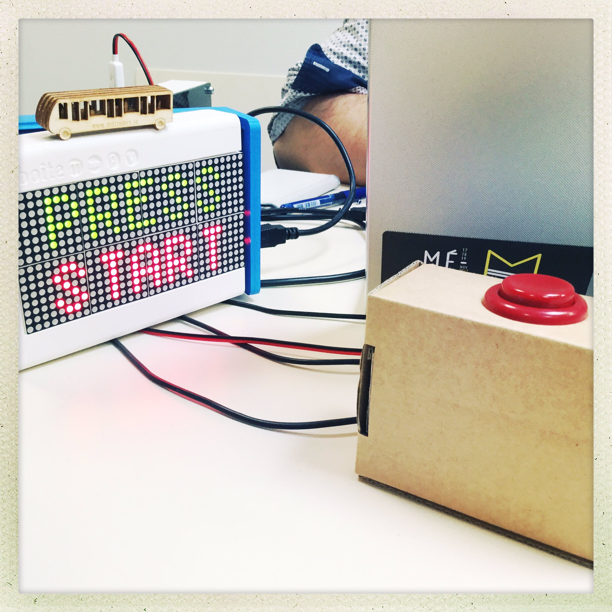
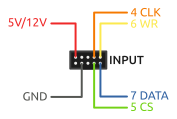

# StarLight
StarLight c'est un jeu accessible à tous qui va mettre une étincelle dans votre trajet de bus !

Créé lors du hackathon MétroMix 2017 à Rennes, ce jeu est un 1D pong sur une bande de led avec un afficheur pour les scores.

## Matériel nécessaire

 * un Arduino Mega
 * une bande de LEDs RGB adressables de type *NeoPixel*
 * un afficheur HT1632c
 * deux boutons d'arcade
 * un condensateur électrolytique 1000 μF / 10 V
 * une résistances 470 Ω
 * deux résistances 10 kΩ
 * deux condensateurs céramique 102 (1 nF)
 * un peu de cable ...

## Montage

À l'aide des résistances 10 kΩ et des condensateurs 1 nF, les boutons sont équipés de filtres anti-rebonds. Le bouton A est raccordé à la broche **10** et le bouton B à la broche **11** :

La bande de led est alimentée en 5V et nécessite un condensateur de 1000 μF en parallèlele de l'alimentation.
On ajoute la résistance 470 Ω en série au signal et on le relie à la broche **3** :

On raccorde la matrice de led à Arduino selon le brochage suivant :

## Documentation du projet

http://www.wiki-rennes.fr/M%C3%A9troMix_2017/StarLight
